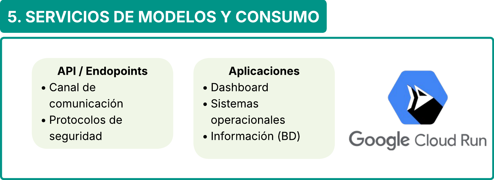

# **Taller Pipeline de MLOps**

**Equipo**:

| Nombres                       | Grupo   |
| ----------------------------- | ------- |
| Anderson Daniel Pipicano Ruiz | Grupo 2 |
| Fredy Yamid Alvarez Palechor  | Grupo 2 |

## **Descripción del problema**

Actualmente, el sector salud genera grandes volúmenes de información provenientes de **historias clínicas, registros hospitalarios, laboratorios y plataformas epidemiológicas**, creando la posibilidad de implementar soluciones inteligentes que apoyen el diagnóstico médico y mejoren la toma de decisiones clínicas. En este contexto, se propone desarrollar una solución basada en Machine Learning y MLOps capaz de predecir la posible presencia de enfermedades comunes y huérfanas a partir de síntomas, antecedentes y datos clínicos de los pacientes, integrando información proveniente de múltiples fuentes médicas. La solución busca **reducir diagnósticos tardíos o incorrectos, optimizar la priorización de pacientes y mejorar la asignación de recursos médicos mediante modelos predictivos confiables, monitoreados y capaces de adaptarse continuamente a nuevos datos y cambios epidemiológicos**.

El pipeline integra procesos de **adquisición de datos, aseguramiento de calidad, ingeniería de características, entrenamiento de modelos, despliegue de servicios inteligentes y monitoreo continuo, permitiendo construir una solución escalable, reproducible y adaptable a nuevos datos clínicos**.

## **1. Fuentes de Datos**

La primera etapa del pipeline corresponde a las **fuentes de información utilizadas para alimentar el sistema analítico y los modelos de Machine Learning**. La solución propuesta estará enfocada **exclusivamente en el procesamiento de datos tabulares provenientes de diferentes entidades y sistemas del sector salud** permitiendo consolidar información clínica estructurada para el entrenamiento y despliegue de modelos predictivos orientados a la detección de enfermedades comunes y enfermedades huérfanas.

Las **principales fuentes de información** consideradas incluyen **historias clínicas electrónicas (HCE), registros hospitalarios, sistemas RIPS**, plataformas gubernamentales como **SISPRO y SIVIGILA, resultados de laboratorio clínico y bases de datos epidemiológicas**. Estas fuentes contienen información relevante relacionada con síntomas, antecedentes médicos, **diagnósticos previos, signos vitales, tratamientos, variables demográficas y evolución clínica de los pacientes**.

Debido a la heterogeneidad de los sistemas clínicos, los datos pueden **encontrarse almacenados en múltiples tecnologías y formatos**. Entre las principales fuentes se contemplan **bases de datos relacionales como PostgreSQL y MySQL, archivos planos en formatos CSV y JSON** así como servicios **expuestos mediante APIs REST** interoperables bajo estándares médicos como **HL7 y FHIR**. La integración de estas fuentes permitirá consolidar información proveniente de múltiples instituciones médicas y plataformas hospitalarias.

La arquitectura **cloud-native propuesta utilizará Google Cloud Platform (GCP)** como plataforma **centralizada de almacenamiento y administración de datos clínicos**. Los datos provenientes de las diferentes fuentes externas serán **integrados y almacenados inicialmente en Google Cloud Storage** el cual funcionará como Data Lake centralizado para conservar tanto información histórica como nuevos registros clínicos provenientes de **hospitales, laboratorios y entidades gubernamentales**.

Posteriormente, la información estructurada será **consolidada en BigQuery, permitiendo disponer de un entorno analítico escalable para consultas, integración y consumo por parte de las etapas posteriores del pipeline MLOps**. Esta centralización facilitará la trazabilidad de los datos, el acceso controlado a la información clínica y la interoperabilidad entre múltiples sistemas médicos.

La **adquisición de información podrá realizarse tanto en modalidad batch como streaming**. Los procesos batch estarán orientados a la carga periódica de **registros clínicos históricos, resultados de laboratorio y bases epidemiológicas** mientras que los procesos streaming permitirán incorporar actualizaciones clínicas en tiempo real, como nuevos diagnósticos o eventos hospitalarios recientes.

Dentro de las principales restricciones del **problema se encuentra el alto desbalance existente entre enfermedades comunes y enfermedades huérfanas** debido a la **baja disponibilidad de registros asociados a enfermedades raras**. Esta limitación representa un reto importante para el entrenamiento de modelos predictivos, ya que puede generar **sesgos y dificultades de generalización sobre clases minoritarias**.

Adicionalmente, la información médica proveniente de múltiples instituciones puede **presentar diferencias semánticas, formatos heterogéneos y distintos estándares de codificación clínica** lo que hace necesaria la implementación posterior de procesos de **validación, homologación y normalización de datos**.

Las principales variables clínicas consideradas dentro de las fuentes de información incluyen:

- Síntomas reportados por el paciente.
- Diagnósticos clínicos previos.
- Variables demográficas.
- Resultados de laboratorio.
- Antecedentes médicos.
- Evolución clínica y temporal del paciente.
- Tratamientos y medicamentos registrados.

## **2. Ingesta y Calidad del Dato**

Una vez centralizada la **información clínica en Google Cloud Storage y BigQuery**, el pipeline continúa con la etapa de **ingesta y calidad del dato**, cuyo **objetivo principal es consumir, validar, transformar y estandarizar** la información médica que será utilizada posteriormente en los procesos de analítica avanzada y entrenamiento de modelos de Machine Learning.

Esta etapa constituye uno de los componentes más críticos dentro de la arquitectura MLOps, ya que garantiza que los **modelos predictivos sean entrenados utilizando información consistente, confiable y clínicamente válida**. Debido a la naturaleza heterogénea de las fuentes médicas, es necesario **implementar procesos automatizados de integración y control de calidad** que permitan reducir inconsistencias y problemas asociados a errores de codificación, registros incompletos o diferencias semánticas entre instituciones hospitalarias.

La arquitectura propuesta utilizará **Google Cloud Dataflow** como servicio principal para la **construcción de pipelines ETL/ELT distribuidos y escalables**. **Dataflow** permitirá procesar grandes volúmenes de información clínica tanto en modalidad batch como streaming, integrándose de manera nativa con los servicios centralizados definidos en la etapa anterior.

Los **procesos batch estarán orientados al consumo periódico de datasets históricos almacenados en Cloud Storage y BigQuery**, permitiendo ejecutar cargas masivas relacionadas con historias clínicas, registros epidemiológicos y resultados de laboratorio. Por otra parte, los procesos streaming permitirán procesar eventos clínicos en tiempo real provenientes de Pub/Sub, como nuevos diagnósticos, actualizaciones de pacientes o resultados médicos recientes.

Dentro del flujo de integración, Dataflow realizará consultas y extracción de información desde las capas centralizadas de almacenamiento definidas en BigQuery y Cloud Storage, consolidando los datos requeridos para las siguientes etapas analíticas del pipeline. Esta arquitectura desacoplada permitirá mantener independencia entre los sistemas de origen y los procesos de procesamiento analítico, facilitando la escalabilidad y mantenimiento de la solución.

Una vez consumida la información, los pipelines de Dataflow ejecutarán procesos automatizados de validación y transformación de datos clínicos, incluyendo tareas como:

- validación estructural de registros,
- identificación de datos faltantes,
- eliminación de duplicados,
- normalización de variables clínicas,
- homologación de formatos médicos,
- validación de tipos de datos,
- verificación de rangos clínicamente válidos,
- y estandarización semántica entre instituciones de salud.

Por ejemplo, durante esta etapa se **podrán detectarse inconsistencias relacionadas con diagnósticos mal codificados, síntomas registrados con nomenclaturas diferentes entre hospitales, valores fisiológicos fuera de rangos clínicamente posibles o registros incompletos asociados a pacientes**.

Adicionalmente, se implementarán reglas automáticas de calidad del dato sobre atributos críticos relacionados con síntomas, antecedentes médicos, resultados de laboratorio y variables demográficas. Estas validaciones permitirán medir indicadores asociados a:

- completitud,
- unicidad,
- consistencia,
- integridad,
- exactitud,
- y distribución estadística de los datos clínicos.

Como parte del **proceso de normalización**, la solución **incorporará un diccionario centralizado** de variables **médicas y catálogos** estandarizados de **diagnósticos y síntomas**, permitiendo homologar información proveniente de múltiples instituciones hospitalarias y reducir problemas derivados de diferencias semánticas o variaciones de codificación clínica.

Posteriormente, los datos procesados y validados serán almacenados nuevamente en BigQuery dentro de capas analíticas optimizadas para consumo por parte de las etapas de procesamiento, ingeniería de características y entrenamiento de modelos. Esta **estructura permitirá mantener separación entre datos crudos, datos procesados y datasets analíticos listos para Machine Learning**.

Debido a la **sensibilidad de la información médica, toda la etapa de ingestión y procesamiento** mantendrá mecanismos de **seguridad y control** de acceso mediante **Cloud IAM, Secret Manager y Cloud KMS** garantizando protección de la información clínica tanto en tránsito como en reposo.

Finalmente, esta etapa permite asegurar que las decisiones clínicas soportadas por los modelos de **Machine Learning se construyan sobre información validada, estandarizada y confiable** reduciendo riesgos asociados a errores de calidad del dato, sesgos analíticos y degradación del desempeño predictivo.

## **3. Procesamiento e Ingeniería de Datos**

La etapa de **procesamiento e ingeniería de datos** tiene como propósito transformar la información clínica en variables útiles para el entrenamiento de los modelos de Machine Learning. En esta fase se realizan **procesos de limpieza, normalización y codificación de datos**, permitiendo **convertir variables categóricas, síntomas y registros clínicos en representaciones numéricas interpretables por los algoritmos**. Asimismo, se manejan valores faltantes y se aplican transformaciones que permitan unificar escalas y formatos entre diferentes fuentes de información.

Posteriormente, se desarrolla la **ingeniería de características**, donde se construyen **nuevas variables derivadas a partir de síntomas, antecedentes médicos, resultados de laboratorio y evolución clínica de los pacientes**. También pueden **generarse variables temporales, agrupaciones de síntomas o representaciones semánticas provenientes de texto clínico e imágenes médicas**. Esta etapa es **fundamental para extraer patrones relevantes y mejorar la capacidad predictiva de los modelos** especialmente en escenarios de enfermedades huérfanas donde la información disponible es limitada y altamente desbalanceada.

## **4. Entrenamiento y Modelos**

La etapa de **entrenamiento y modelos** tiene como **objetivo desarrollar soluciones predictivas capaces de identificar posibles enfermedades a partir de la información clínica procesada**. Dependiendo del tipo de datos disponibles pueden utilizarse **modelos de Machine Learning tradicionales como Random Forest, XGBoost, LightGBM o CatBoost** para **datos tabulares y estructurados**, así como **modelos de Deep Learning como CNN para imágenes médicas y Transformers para texto clínico**. Adicionalmente, pueden emplearse técnicas no **supervisadas como K-Means y HDBSCAN** para **segmentación de pacientes, identificación de patrones clínicos y detección de agrupamientos asociados a posibles enfermedades**. Debido al desbalance existente en enfermedades huérfanas, también pueden incorporarse estrategias como balanceo de clases, transfer learning o modelos híbridos para mejorar la capacidad de generalización.

El **entrenamiento del modelo se realiza utilizando conjuntos de datos divididos en entrenamiento, validación y prueba**, evitando fuga de información entre pacientes y garantizando una evaluación confiable del desempeño. Durante esta etapa se ejecutan procesos de **ajuste de hiperparámetros, validación cruzada y comparación entre diferentes algoritmos** con el fin de **seleccionar el modelo más robusto y preciso**. La evaluación se realiza mediante **métricas como precision, recall, F1-score y ROC-AUC**, priorizando especialmente la **reducción de falsos negativos** debido al impacto clínico que puede representar un diagnóstico no detectado. Finalmente los **modelos y resultados obtenidos son versionados y registrados para garantizar trazabilidad, reproducibilidad y control sobre futuras actualizaciones del sistema**.

## **5. Automatizacion y despliegue**

## **6. Servicios de Modelos y Consumo**

La etapa de servicios de **modelos y consumo** tiene como **objetivo desplegar los modelos de Machine Learning en una infraestructura centralizada que permita su acceso desde diferentes sistemas clínicos y aplicaciones médicas**. Los modelos entrenados serán empaquetados en **contenedores y desplegados en plataformas cloud como Google Cloud Platform (GCP), Microsoft Azure o AWS** utilizando servicios de orquestación y ejecución que permitan escalar automáticamente según la demanda de consultas médicas. Esto permitirá mantener alta disponibilidad, tolerancia a fallos y capacidad de procesamiento en tiempo real para múltiples instituciones o usuarios concurrentes.

Una vez desplegados, los modelos serán **expuestos mediante APIs REST seguras y endpoints específicos para inferencia** autenticados mediante tokens o credenciales institucionales. A través de estos **servicios, aplicaciones hospitalarias, dashboards clínicos, historias clínicas electrónicas o plataformas web** podrán enviar información de pacientes en **formato JSON** para recibir respuesta predicciones asociadas a **posibles enfermedades, probabilidades de riesgo y explicaciones generadas por el modelo**. Los usuarios clínicos accederán a estas funcionalidades desde interfaces web o sistemas hospitalarios integrados, sin necesidad de interactuar directamente con la infraestructura del modelo.

## **7. IA Generativa y RAG**

La etapa de **IA Generativa y RAG** se incorpora como un componente adicional orientado a **mejorar la interacción entre el sistema y el usuario clínico** funcionando como un **apoyo inteligente para la interpretación y análisis de la información médica**. Mediante **técnicas de Retrieval-Augmented Generation (RAG)** el sistema podrá consultar información relevante desde bases documentales, guías clínicas, antecedentes médicos o resultados generados por los modelos predictivos, permitiendo generar respuestas contextualizadas y más comprensibles para el personal médico.

Este componente también **facilitará el procesamiento de texto clínico proveniente de historias médicas, notas de evolución o reportes hospitalarios** ayudando a resumir información relevante y extraer contexto útil para el diagnóstico. Adicionalmente, la **IA generativa podrá asistir en la interpretación de las predicciones generadas** por los modelos de Machine Learning, proporcionando explicaciones más claras sobre posibles **factores de riesgo, síntomas relevantes o patrones detectados, fortaleciendo así la toma de decisiones clínicas y la interacción del usuario con la solución analítica**.

## **8. Monitoreo y Observabilidad**

La etapa de **monitoreo y observabilidad** es fundamental debido a la criticidad del entorno médico y al impacto que pueden tener las predicciones sobre los pacientes. **El sistema debe supervisar continuamente métricas de desempeño del modelo a trevez de las metricas como precisión, recall, F1-score, tasa de falsos negativos y tiempos de respuesta** con el fin de garantizar que las predicciones mantengan un nivel adecuado de confiabilidad y estabilidad en producción. Asimismo se **monitorea la calidad de los datos de entrada para detectar inconsistencias, valores atípicos, registros incompletos o cambios en la estructura de la información proveniente de las diferentes fuentes clínicas**.

Adicionalmente, el pipeline contempla **mecanismos de detección de drift de datos y drift de concepto** para identificar variaciones en **patrones epidemiológicos, aparición de nuevas enfermedades o cambios en el comportamiento de la población que puedan degradar el desempeño del modelo**. Debido a que continuamente se generan nuevos registros clínicos y datos médicos, el sistema debe permitir procesos periódicos de reentrenamiento utilizando información más reciente y validada. Antes de desplegar **nuevas versiones del modelo, estas deben pasar nuevamente por procesos de evaluación técnica y validación clínica, garantizando trazabilidad, control de versiones y mejora continua de la solución**.

## **Conexión Integral del Pipeline**

# 3. Procesamiento e Ingeniería de Datos

Una vez finalizados los procesos de ingestión, validación y control de calidad descritos en la etapa anterior, los datos clínicos consolidados y estandarizados son almacenados en BigQuery, desde donde serán consumidos por los procesos de procesamiento analítico e ingeniería de características. El objetivo de esta etapa es transformar la información clínica validada en variables representativas que permitan maximizar la capacidad predictiva de los modelos de Machine Learning.

Esta etapa constituye el punto de transición entre la preparación de datos y el desarrollo de modelos analíticos, siendo responsable de convertir registros clínicos en conjuntos de datos estructurados y optimizados para el entrenamiento de algoritmos predictivos.

Para soportar estos procesos se utilizarán Google Colab y Apache Spark como herramientas principales de procesamiento y análisis. Apache Spark permitirá ejecutar transformaciones distribuidas sobre grandes volúmenes de datos clínicos almacenados en BigQuery, facilitando la construcción de pipelines escalables para el procesamiento masivo de información médica. Por su parte, Google Colab será utilizado por el equipo de Data Science como entorno colaborativo para el análisis exploratorio, experimentación y validación de nuevas variables antes de incorporarlas a los procesos productivos.

Los datos procesados en la etapa anterior serán consultados desde BigQuery y cargados en Spark para ejecutar operaciones de transformación y preparación analítica. Entre las principales actividades desarrolladas durante esta fase se encuentran:

* Limpieza complementaria de datos.
* Tratamiento de valores faltantes.
* Normalización y estandarización de variables.
* Conversión de tipos de datos.
* Codificación de variables categóricas mediante técnicas como One-Hot Encoding y Dummy Encoding.
* Preparación de variables temporales y secuenciales.

Durante esta etapa se realizará la ingeniería de características (Feature Engineering), orientada a construir variables derivadas que permitan representar de manera más efectiva el comportamiento clínico de los pacientes. A partir de los datos históricos se generarán indicadores relacionados con antecedentes médicos, frecuencia de consultas, hospitalizaciones previas, evolución de síntomas y otras variables clínicas relevantes que no se encuentran explícitamente registradas en las fuentes originales.

Adicionalmente, se construirán variables temporales para capturar tendencias y patrones de evolución de la condición médica del paciente, así como procesos de codificación y representación de variables categóricas mediante técnicas como One-Hot Encoding, Dummy Encoding y embeddings. Estas transformaciones permitirán obtener conjuntos de datos enriquecidos y optimizados para el entrenamiento de los modelos de Machine Learning en la siguiente etapa del pipeline.

Google Colab desempeñará un papel fundamental durante esta fase al permitir que los científicos de datos realicen análisis exploratorios avanzados, validen nuevas hipótesis clínicas, evalúen correlaciones entre variables y experimenten con diferentes estrategias de construcción de características. Una vez validadas, estas transformaciones podrán incorporarse posteriormente a los procesos productivos implementados mediante Spark.

Como resultado de esta etapa se generarán datasets analíticos enriquecidos y optimizados para Machine Learning, los cuales serán almacenados nuevamente en BigQuery y utilizados como entrada para la siguiente etapa del pipeline, correspondiente al entrenamiento, evaluación y registro de modelos en Vertex AI.

De esta manera, la etapa de procesamiento e ingeniería de datos actúa como un puente entre los procesos de calidad del dato y el desarrollo de modelos predictivos, garantizando que los algoritmos sean entrenados utilizando información representativa, consistente y alineada con los objetivos clínicos de la solución.

# 4. Entrenamiento y Modelado

Una vez finalizada la etapa de procesamiento e ingeniería de características, los datasets analíticos enriquecidos son almacenados en BigQuery y utilizados como entrada para los procesos de entrenamiento y evaluación de modelos. El objetivo de esta etapa es construir modelos predictivos capaces de identificar la posible presencia de enfermedades comunes y enfermedades huérfanas a partir de información clínica, síntomas, antecedentes médicos y variables derivadas generadas en las fases previas del pipeline.

Para el desarrollo de los modelos se utilizará Vertex AI como plataforma central de Machine Learning, permitiendo gestionar experimentos, entrenamientos, evaluación de resultados y registro de modelos dentro de una arquitectura MLOps unificada. Los procesos de entrenamiento serán implementados utilizando Scikit-Learn como librería base para la preparación de datos, validación y evaluación de modelos, complementada con los algoritmos XGBoost y LightGBM, seleccionados por su alto desempeño en problemas de clasificación sobre datos tabulares, capacidad para manejar variables heterogéneas, robustez frente a datos faltantes y eficiencia computacional en grandes volúmenes de información.

La fase inicial corresponde a la preparación y análisis de los datos, donde se realizará un análisis exploratorio (EDA) orientado a comprender la distribución de las variables, identificar posibles sesgos y evaluar el comportamiento de las clases objetivo. Debido a la baja disponibilidad de registros asociados a enfermedades huérfanas, se aplicarán estrategias de balanceo de clases para mitigar el desbalance del conjunto de datos y mejorar la capacidad de generalización de los modelos. Posteriormente, los datos serán divididos en conjuntos de entrenamiento, validación y prueba para garantizar una evaluación objetiva del desempeño.

Durante el entrenamiento se desarrollarán múltiples experimentos utilizando XGBoost y LightGBM, ajustando hiperparámetros y configuraciones mediante procesos iterativos de optimización. Vertex AI permitirá administrar estos experimentos, registrar métricas y mantener trazabilidad sobre los diferentes modelos generados. Esta capacidad resulta fundamental para identificar configuraciones óptimas y asegurar la reproducibilidad de los resultados obtenidos.

La etapa de evaluación se enfocará en medir el desempeño predictivo utilizando métricas apropiadas para problemas médicos, donde la detección correcta de pacientes con posibles enfermedades tiene una alta relevancia clínica. Entre las métricas consideradas se incluyen precisión (Precision), sensibilidad (Recall), F1-Score, matriz de confusión y ROC-AUC. Adicionalmente, se aplicarán técnicas de validación cruzada para reducir el riesgo de sobreajuste y obtener estimaciones más robustas del comportamiento del modelo.

Debido a la naturaleza crítica del dominio de la salud, la solución incorporará mecanismos de explicabilidad utilizando herramientas como SHAP (SHapley Additive Explanations), permitiendo identificar qué variables clínicas influyen en cada predicción realizada por el modelo. Esto facilitará la interpretación de resultados por parte del personal médico y contribuirá a generar confianza en las recomendaciones emitidas por el sistema.

Finalmente, los modelos aprobados serán registrados y versionados en Vertex AI Model Registry, donde se almacenarán junto con sus métricas, configuraciones de entrenamiento y metadatos asociados. Este registro permitirá mantener trazabilidad completa sobre cada versión del modelo, garantizar reproducibilidad y facilitar la integración con las etapas posteriores de automatización, despliegue y monitoreo definidas dentro del pipeline MLOps.

# 5. Automatización y Despliegue

Una vez que los modelos han sido entrenados, evaluados y registrados en Vertex AI, el pipeline continúa con la etapa de automatización y despliegue. El objetivo de esta fase es garantizar que los cambios realizados sobre el código, los pipelines de Machine Learning y las nuevas versiones de modelos puedan ser integrados, validados y desplegados de forma controlada, reproducible y automatizada.

La solución adoptará una estrategia de CI/CD (Continuous Integration / Continuous Deployment) basada en GitHub y GitHub Actions, permitiendo automatizar el ciclo completo desde el desarrollo hasta la puesta en producción. Esta aproximación reduce errores manuales, mejora la trazabilidad de los cambios y facilita la colaboración entre los equipos de ingeniería de datos, Machine Learning y operaciones.

## Integración

Todo el código fuente asociado al proyecto, incluyendo notebooks, scripts de procesamiento, pipelines de entrenamiento, configuraciones de despliegue y componentes de inferencia, será almacenado y versionado mediante GitHub. El uso de control de versiones permitirá gestionar cambios, mantener historial de modificaciones, implementar revisiones mediante Pull Requests y garantizar la trazabilidad de las diferentes versiones desarrolladas a lo largo del proyecto.

Cada modificación aprobada en el repositorio actuará como disparador de los procesos automáticos definidos en GitHub Actions, iniciando el flujo de integración continua.

## Validación y Testing

Durante esta etapa, GitHub Actions ejecutará automáticamente diferentes validaciones antes de permitir el despliegue de una nueva versión. Entre las actividades consideradas se encuentran:

Validación de calidad del código.
Ejecución de pruebas unitarias.
Verificación de dependencias.
Validación de pipelines de Machine Learning.
Comprobación de configuraciones de despliegue.
Verificación de compatibilidad entre versiones.

Estas pruebas permiten detectar errores de manera temprana y garantizar que únicamente versiones validadas puedan avanzar hacia ambientes productivos.

## Build y Registro

Una vez superadas las validaciones, el pipeline procederá al empaquetado de la solución utilizando Docker. La creación de imágenes de contenedor garantiza que el modelo y sus dependencias puedan ejecutarse de manera consistente en cualquier entorno, independientemente de la infraestructura subyacente.

Las imágenes generadas serán almacenadas en Artifact Registry, proporcionando un repositorio centralizado para la gestión, versionamiento y distribución de artefactos. De manera complementaria, las versiones aprobadas de los modelos continuarán siendo administradas mediante Vertex AI Model Registry, permitiendo mantener trazabilidad entre código, datasets, experimentos y modelos desplegados.

## Despliegue Continuo

Finalmente, GitHub Actions automatizará el proceso de despliegue hacia los entornos productivos definidos dentro de la arquitectura. Dependiendo del caso de uso, las nuevas versiones podrán ser publicadas en Vertex AI Endpoints para inferencia especializada de modelos o en Cloud Run para exponer servicios REST consumidos por aplicaciones clínicas y sistemas hospitalarios.

Esta estrategia permite implementar despliegues controlados, realizar actualizaciones de manera segura y mantener la capacidad de recuperación mediante rollback ante posibles fallos. Adicionalmente, cada despliegue quedará registrado para garantizar auditoría, trazabilidad y cumplimiento de los requisitos de gobierno definidos para el proyecto.

La salida de esta etapa corresponde a modelos y servicios desplegados en producción, listos para ser consumidos por médicos, aplicaciones clínicas y sistemas hospitalarios, los cuales serán posteriormente supervisados mediante los mecanismos de monitoreo y observabilidad definidos en las siguientes etapas del pipeline MLOps.

## 6. Servicios de Modelos y Consumo

Una vez completado el proceso de automatización y despliegue, los modelos predictivos quedan disponibles para ser consumidos por los diferentes usuarios y sistemas de la organización. El objetivo de esta etapa es proporcionar mecanismos seguros y escalables que permitan realizar inferencias en tiempo real a partir de la información clínica suministrada por médicos, aplicaciones hospitalarias y sistemas de información del sector salud.

La solución utilizará Google Cloud Run como plataforma principal para la publicación de servicios de inferencia mediante APIs REST. Estas APIs actuarán como punto de acceso a los modelos desplegados, permitiendo recibir solicitudes, validar los datos de entrada y retornar las predicciones generadas por los modelos de Machine Learning. El uso de Cloud Run permite escalar automáticamente según la demanda y simplifica la administración de infraestructura al operar bajo un modelo serverless.

Las APIs implementarán mecanismos de autenticación, autorización y cifrado mediante HTTPS para garantizar la seguridad de la información médica transmitida. De esta forma, únicamente usuarios y sistemas autorizados podrán acceder a los servicios de inferencia, cumpliendo con los requisitos de privacidad y protección de datos establecidos para entornos clínicos.

Los servicios desplegados podrán ser consumidos por diferentes aplicaciones dentro del ecosistema de salud, incluyendo dashboards clínicos para médicos, sistemas hospitalarios, plataformas de seguimiento epidemiológico y aplicaciones de soporte a la toma de decisiones. Estas aplicaciones enviarán información clínica del paciente a través de las APIs y recibirán como respuesta la probabilidad o clasificación asociada a una posible enfermedad, permitiendo apoyar el proceso diagnóstico.

Adicionalmente, esta capa facilitará la integración con otros sistemas corporativos mediante interfaces estandarizadas, permitiendo almacenar resultados de predicción en bases de datos, generar alertas clínicas o alimentar procesos analíticos posteriores. Gracias a esta arquitectura desacoplada, los modelos podrán evolucionar y actualizarse sin afectar directamente a las aplicaciones consumidoras.

Finalmente, todos los eventos generados durante la ejecución de las inferencias, incluyendo solicitudes recibidas, tiempos de respuesta, errores y resultados entregados, serán registrados para alimentar la etapa de monitoreo y observabilidad. Esto permitirá supervisar el desempeño operativo de la solución, detectar posibles incidentes y mantener trazabilidad sobre el uso de los modelos en producción.

Componentes principales de la etapa

API / Endpoints

Canal de comunicación entre aplicaciones y modelos.
Validación de solicitudes.
Autenticación y autorización.
Comunicación segura mediante HTTPS.

Aplicaciones consumidoras

Dashboards clínicos.
Sistemas hospitalarios.
Sistemas de información médica.
Aplicaciones de soporte a la decisión clínica.

Google Cloud Run

Ejecución serverless de APIs.
Escalamiento automático.
Alta disponibilidad.
Integración nativa con servicios de Google Cloud.

# 7. Monitoreo y Observabilidad

La etapa de monitoreo y observabilidad tiene como objetivo supervisar de forma continua el comportamiento operativo de la solución, el desempeño de los modelos de Machine Learning y la calidad de los datos utilizados durante las inferencias. Debido a la criticidad del entorno médico y al impacto potencial de las predicciones sobre la atención de los pacientes, resulta indispensable contar con mecanismos que permitan detectar oportunamente degradaciones del servicio, anomalías en los datos y disminuciones en la capacidad predictiva de los modelos desplegados.

La arquitectura propuesta utilizará **Google Cloud Monitoring** como plataforma central de observabilidad, permitiendo supervisar métricas técnicas y funcionales asociadas a los diferentes componentes del sistema. Entre las principales métricas monitoreadas se encuentran la disponibilidad de los servicios, utilización de recursos, tiempos de respuesta de las APIs, latencia de inferencia, número de solicitudes procesadas, tasas de error y cumplimiento de acuerdos de nivel de servicio (SLA). Adicionalmente, se configurarán alertas automáticas para notificar eventos críticos que requieran intervención por parte del equipo de operación o Machine Learning.

Desde la perspectiva analítica, el sistema realizará seguimiento continuo al desempeño de los modelos mediante indicadores como precisión (Precision), sensibilidad (Recall), F1-Score, ROC-AUC y tasa de falsos negativos. Estas métricas permitirán identificar posibles degradaciones en la calidad de las predicciones y evaluar si el modelo continúa cumpliendo los criterios clínicos definidos durante su validación.

Complementariamente, se implementarán mecanismos de monitoreo de calidad del dato para detectar registros incompletos, valores atípicos, inconsistencias estructurales y cambios inesperados en la distribución de las variables clínicas. Este seguimiento resulta especialmente importante debido a que los datos provienen de múltiples instituciones y sistemas hospitalarios, los cuales pueden sufrir modificaciones a lo largo del tiempo.

La solución también incorporará procesos de detección de **Data Drift** y **Concept Drift**, orientados a identificar cambios en los patrones de los datos o en el comportamiento epidemiológico de la población que puedan afectar el desempeño de los modelos. La detección temprana de estos eventos permitirá activar procesos de análisis y reentrenamiento utilizando información más reciente y representativa del contexto clínico actual.

Para garantizar la trazabilidad completa de las operaciones, todas las solicitudes realizadas a los modelos, predicciones generadas, tiempos de respuesta, errores de ejecución, versiones de modelos utilizadas y eventos relevantes del sistema serán almacenados en **BigQuery**. Este repositorio histórico permitirá construir tableros de seguimiento, realizar análisis operacionales y mantener evidencia para auditorías clínicas y regulatorias.

Entre los principales elementos almacenados para fines de observabilidad y trazabilidad se encuentran:

* Fecha y hora de cada inferencia.
* Identificador anonimizado del paciente.
* Variables de entrada utilizadas por el modelo.
* Resultado de la predicción generada.
* Nivel de confianza asociado a la inferencia.
* Versión del modelo utilizada.
* Tiempos de respuesta del servicio.
* Errores y excepciones ocurridas durante la ejecución.
* Eventos de despliegue y actualizaciones del modelo.

Adicionalmente, mediante **Cloud Logging** se centralizarán los registros operativos generados por Cloud Run, Vertex AI, Dataflow y los diferentes componentes de la arquitectura, facilitando el diagnóstico de incidentes y la investigación de posibles fallos operacionales.

Finalmente, esta etapa constituye el mecanismo de retroalimentación del pipeline MLOps. Cuando se detecten degradaciones significativas en el desempeño del modelo, problemas recurrentes de calidad de datos o eventos de drift, se podrán activar procesos de reentrenamiento utilizando nuevos datos clínicos incorporados al sistema. Las nuevas versiones deberán recorrer nuevamente las etapas de procesamiento, entrenamiento, validación y despliegue antes de ser promovidas a producción, garantizando trazabilidad, control de versiones y mejora continua de la solución.

# 8 Conexión Integral del Pipeline

El pipeline funciona como un ecosistema continuo e integrado donde cada etapa alimenta a la siguiente:

Las fuentes clínicas suministran datos heterogéneos provenientes de sistemas hospitalarios, plataformas gubernamentales, laboratorios y registros médicos.
La ingesta y calidad del dato consolidan, validan y estandarizan la información almacenada en la plataforma de datos.
El procesamiento e ingeniería de datos transforman la información clínica en variables analíticas y conjuntos de datos optimizados para Machine Learning.
Los modelos de Machine Learning aprenden patrones clínicos, son evaluados y generan predicciones sobre posibles enfermedades comunes y huérfanas.
La automatización y despliegue garantizan el versionamiento, validación, empaquetado y publicación controlada de los modelos en entornos productivos.
Los servicios de modelos y consumo exponen las capacidades predictivas mediante APIs y aplicaciones que pueden ser utilizadas por médicos y sistemas clínicos.
El monitoreo y observabilidad supervisan continuamente el comportamiento de los modelos, la calidad de los datos y el desempeño de la plataforma, retroalimentando el pipeline con nueva información para futuros procesos de reentrenamiento y mejora continua.
8.
Diagrama general
Imagen 1. Diagrama general del proceso
Imagen 2. Tecnologías recomendadas

